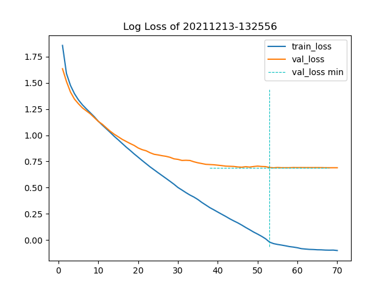

# Transformer Example for ML4NLP - Winter 21/22

## Usage
```bash
# download the repository to your local machine
git clone https://github.com/smnmnkr/ML4NLP-Transformer.git

# move into repository
cd ML4NLP-Transformer

# install requirements
make install

# or install an conda environment
conda env create -f venv.yml

# run default configuration
# if you use conda activate the environment first:
# conda activate Seq2SeqTransformer
make run
```

## Example Log (based on config.json)
```
2021-12-13 13:25:56,862 [INFO] -- LOAD DATA
2021-12-13 13:26:02,830 [INFO] -- LOAD TRANSFORMER
2021-12-13 13:26:06,535 [INFO] -- TRANSLATE
2021-12-13 13:26:06,590 [INFO] -- [0] ein mann steht auf einem baugerüst . ->  centipede centipede centipede centipede centipede centipede sidwalk sidwalk sidwalk sidwalk sidwalk sidwalk sidwalk
2021-12-13 13:26:06,632 [INFO] -- [1] männer spielen auf trommeln . ->  centipede sidwalk sidwalk sidwalk sidwalk sidwalk sidwalk sidwalk sidwalk sidwalk sidwalk
2021-12-13 13:26:06,682 [INFO] -- [2] ein kind läuft auf einem weg . ->  centipede sidwalk sidwalk sidwalk sidwalk sidwalk sidwalk sidwalk sidwalk sidwalk sidwalk sidwalk sidwalk
2021-12-13 13:26:06,682 [INFO] -- BEGIN TRAINING
2021-12-13 13:27:55,336 [INFO] -- [5]	loss(train): 3.812	loss(val): 3.672	time: 22.335s
2021-12-13 13:29:48,276 [INFO] -- [10]	loss(train): 3.106	loss(val): 3.102	time: 20.631s
2021-12-13 13:31:37,706 [INFO] -- [15]	loss(train): 2.602	loss(val): 2.678	time: 20.603s
2021-12-13 13:33:27,065 [INFO] -- [20]	loss(train): 2.204	loss(val): 2.407	time: 20.675s
2021-12-13 13:35:18,217 [INFO] -- [25]	loss(train): 1.900	loss(val): 2.252	time: 20.710s
2021-12-13 13:37:11,037 [INFO] -- [30]	loss(train): 1.650	loss(val): 2.158	time: 20.669s
2021-12-13 13:39:02,288 [INFO] -- [35]	loss(train): 1.471	loss(val): 2.089	time: 21.061s
2021-12-13 13:40:51,706 [INFO] -- [40]	loss(train): 1.305	loss(val): 2.042	time: 20.635s
2021-12-13 13:42:42,876 [INFO] -- [45]	loss(train): 1.177	loss(val): 2.008	time: 20.702s
2021-12-13 13:44:29,905 [INFO] -- [50]	loss(train): 1.057	loss(val): 2.024	time: 20.625s
2021-12-13 13:46:15,943 [INFO] -- [55]	loss(train): 0.958	loss(val): 1.997	time: 20.617s
2021-12-13 13:48:00,470 [INFO] -- [60]	loss(train): 0.928	loss(val): 1.995	time: 20.576s
2021-12-13 13:49:45,536 [INFO] -- [65]	loss(train): 0.910	loss(val): 1.995	time: 20.729s
2021-12-13 13:51:30,951 [INFO] -- [70]	loss(train): 0.904	loss(val): 1.993	time: 20.690s
2021-12-13 13:53:15,876 [INFO] -- [75]	loss(train): 0.903	loss(val): 1.993	time: 20.713s
2021-12-13 13:55:00,857 [INFO] -- [80]	loss(train): 0.902	loss(val): 1.993	time: 20.662s
2021-12-13 13:56:45,894 [INFO] -- [85]	loss(train): 0.900	loss(val): 1.994	time: 20.627s
2021-12-13 13:58:30,448 [INFO] -- [90]	loss(train): 0.898	loss(val): 1.994	time: 20.565s
2021-12-13 14:00:15,104 [INFO] -- [95]	loss(train): 0.898	loss(val): 1.994	time: 20.688s
2021-12-13 14:01:59,842 [INFO] -- [100]	loss(train): 0.897	loss(val): 1.994	time: 20.599s
2021-12-13 14:03:44,538 [INFO] -- [105]	loss(train): 0.894	loss(val): 1.995	time: 20.621s
2021-12-13 14:05:29,316 [INFO] -- [110]	loss(train): 0.892	loss(val): 1.995	time: 20.722s
2021-12-13 14:07:13,922 [INFO] -- [115]	loss(train): 0.893	loss(val): 1.995	time: 20.594s
2021-12-13 14:08:58,494 [INFO] -- [120]	loss(train): 0.891	loss(val): 1.996	time: 20.615s
2021-12-13 14:09:10,174 [INFO] -- User interrupted training, trying to proceed and save model
2021-12-13 14:09:10,865 [INFO] -- Loaded best model from checkpoint
2021-12-13 14:09:10,866 [INFO] -- [54]	loss(train): 0.965	loss(val): 1.991
2021-12-13 14:09:10,866 [INFO] -- TRANSLATE
2021-12-13 14:09:10,913 [INFO] -- [0] ein mann steht auf einem baugerüst . ->  An emergency worker is standing on a piece of art . 
2021-12-13 14:09:10,951 [INFO] -- [1] männer spielen auf trommeln . ->  Local students are playing drums on the drums . 
2021-12-13 14:09:10,989 [INFO] -- [2] ein kind läuft auf einem weg . ->  A kid is running away from a slide . 
```


## Example Config (reduced network size)
```json
{
  "model": {
    "num_encoder_layers": 2,
    "num_decoder_layers": 2,
    "emb_size": 128,
    "nhead": 4,
    "dim_feedforward": 128,
    "dropout": 0.3
  },
  "training": {
    "seed": 42,
    "epochs": 40,
    "report_every": 5,
    "batch_size": 32,
    "log_path": "./results/XX/",
    "optimizer": {
      "lr": 1e-4,
      "betas": [
        0.9,
        0.98
      ],
      "eps": 1e-9
    },
    "scheduler": {
      "factor": 0.8,
      "patience": 10
    },
    "stopper": {
      "delta": 0.1,
      "patience": 20
    }
  },
  "predict": [
    "ein mann steht auf einem baugerüst .",
    "männer spielen auf trommeln .",
    "ein kind läuft auf einem weg ."
  ]
}
```

## Sources

* PyTorch Transformer, "NLP From Scratch": <https://pytorch.org/tutorials/beginner/translation_transformer.html>
* A detailed guide to PyTorch’s nn.Transformer() module: <https://towardsdatascience.com/a-detailed-guide-to-pytorchs-nn-transformer-module-c80afbc9ffb1>